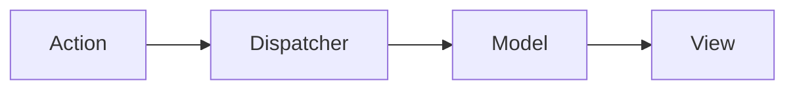

# 인프런 Vue.js 강좌 연습
## [Vue.js 중급 강좌 - 웹앱 제작으로 배워보는 Vue.js, ES6, Vuex](https://inf.run/PvK9)

### 프로젝트 설정
##### vue CLI로 프로젝트 생성
```bash
$ vue init webpack-simple vue-todo

? Project name vue-todo
? Project description A Vue.js project
? Author kil <godngu@gmail.com>
? License MIT
? Use sass? (y/N) N
```

##### 프로젝트 실행
```bash
$ cd vue-todo
$ npm install
$ npm run dev
```

##### 반응형 웹을 위한 메타태그 삽입
- [Viewport](https://developer.mozilla.org/en-US/docs/Web/HTML/Viewport_meta_tag)
```html
<meta name="viewport" content="width=device-width, initial-scale=1">
```

##### fontawesome
```html
<link rel="stylesheet" href="https://pro.fontawesome.com/releases/v5.10.0/css/all.css"
          integrity="sha384-AYmEC3Yw5cVb3ZcuHtOA93w35dYTsvhLPVnYs9eStHfGJvOvKxVfELGroGkvsg+p" crossorigin="anonymous"/>
```

##### google font ubuntu
```html
<link rel="stylesheet" type="text/css" href="//fonts.googleapis.com/css?family=Ubuntu"/>
```

##### `scoped`: 컴포넌트 안에서만 유효한 style 속성이 적용된다.
```html
<style scoped></style>
```

##### create()
- 인스턴스가 생성되자마자 호출되는 라이프사이클 훅(hook)


### Modal
- [모달 컴포넌트 Example](https://kr.vuejs.org/v2/examples/modal.html)

#### slot
- `slot`이 포함된 컴포넌트를 등록한 컴포넌트에서 재정의 할 수 있다.

Modal.vue
```html
<slot name="header">default header</slot>
```

TodoInput.vue 에서 header 내용 재정의
```html
<slot name="header">경고!!</slot>
```

### Transitions & Animation
- [가이드](https://kr.vuejs.org/v2/guide/transitions.html)


### Module
```javascript
// libs/math.js
export function sum(x, y) {
    return x + y;
}

// main.js
import {sum} from 'libs/math.js';

// import된 함수 사용
sum(1, 2);
```

#### default
- 한 개의 파일에서 하나밖에 export 되지 않는다.
- 다른 함수가 export 되지 않도록 모듈화를 한다.
```javascript
// util.js
export default function (x) {
    return console.log(x);
}

// main.js
// 익명함수 호출
// function (x) { return console.log(x); }
import util from 'util.js'; // 익명 함수를 다른 이름으로 사용할 수 있다.
console.log(util);
util('hi');

// app.js
import log from 'util.js' // 익명 함수를 다른 이름으로 사용할 수 있다.
log('hi');
```


## Vuex

---
- 상태 관리 패턴
- 복잡한 애플리케이션의 컴포넌트들을 효율적으로 관리하는 라이브러리
- React의 Flux 패턴에 기인함
- 주요 속성
    - `state`, `getters`, `mutations`, `actions`
    - (`data`, `computed`, `methods`, `async methods` 와 대응된다.)

### Flux 패턴
- MVC 패턴의 복잡한 데이터 흐름 문제를 해결하기 위한 개발 패턴

